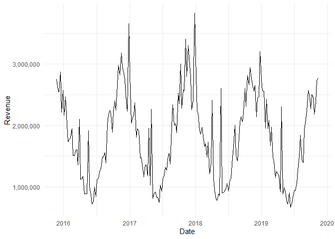
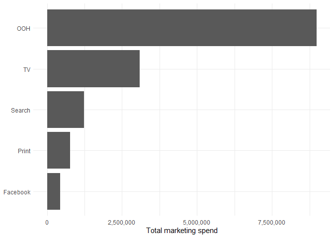
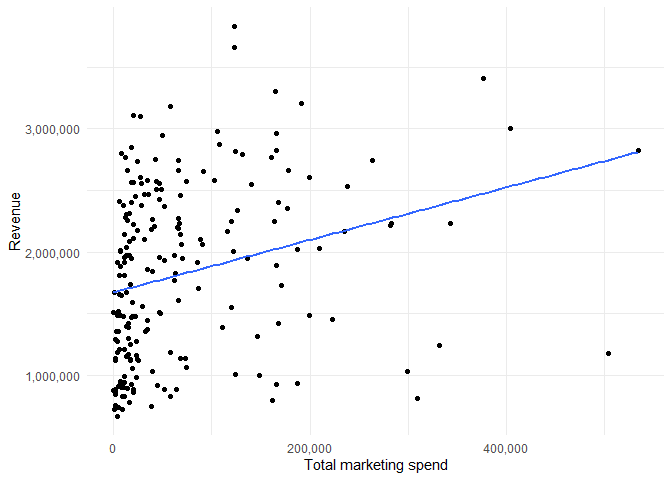
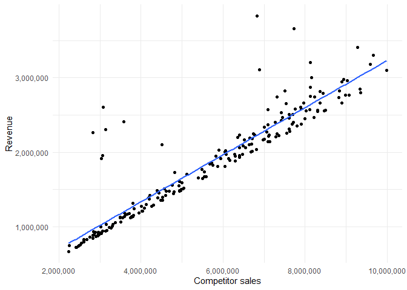
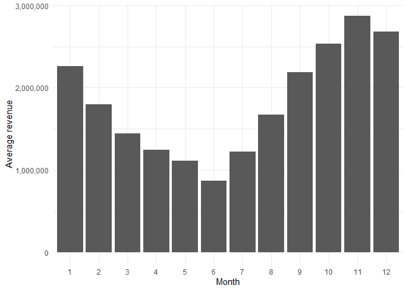
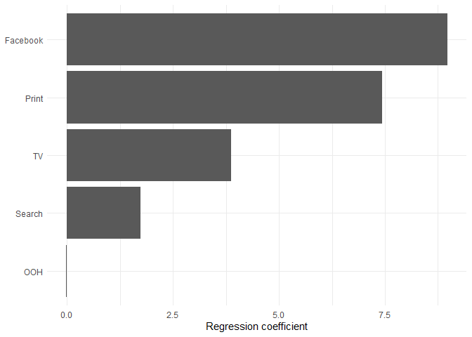
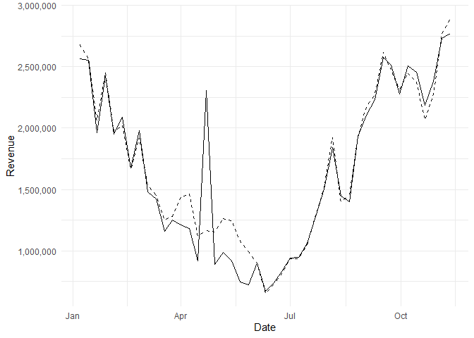

# Marketing Performance Analysis
Eetu Tammi

## Introduction

This project analyzes the relationship between marketing spending and
weekly revenue using a simulated marketing dataset.

The analysis focuses on five marketing channels: TV, OOH, Print,
Facebook, and Search. It also considers competitor sales and
seasonality.

The first research question is:

**How is marketing spending associated with weekly revenue?**

The analysis examines marketing spend by channel, correlations between
marketing activity and revenue, seasonality, and a multiple linear
regression model.

The second research question is:

**How well can revenue be predicted using marketing activity, competitor
sales, and seasonality?**

The model is evaluated using a chronological train/test split, with
observations before 2019 used for training and 2019 observations used as
the test set.

The third research question is:

**Do marketing activities from previous weeks improve revenue
predictions?**

One- and two-week lags are added to each marketing channel and compared
with the simpler baseline model using MAE, RMSE, and MAPE.

## Data

The analysis uses Meta’s simulated weekly marketing dataset.

The dataset contains weekly observations of:

- revenue
- TV spend
- OOH spend
- Print spend
- Facebook spend
- Search spend
- competitor sales
- events
- newsletter activity

The analysis focuses on the five paid marketing channels, competitor
sales, and calendar month.

## Data Preparation

The data contains 208 weekly observations covering the period from
November 2015 to November 2019.

The analysis uses the following marketing variables:

- `tv_S`
- `ooh_S`
- `print_S`
- `facebook_S`
- `search_S`

Competitor sales are included as a control variable because they
represent an external business factor that is strongly associated with
revenue.

Calendar month is included to account for recurring seasonal patterns.

    # A tibble: 1 × 6
      observations variables start_date end_date   missing_values duplicate_rows
             <int>     <int> <date>     <date>              <int>          <int>
    1          208        13 2015-11-23 2019-11-11              0              0

The dataset contains **208 weekly observations** and no missing values
or duplicate rows.

## Exploratory Analysis

### Revenue Over Time

The first step is to examine how revenue changes over time.



Revenue shows substantial variation over time and a recurring seasonal
pattern.

### Marketing Spend by Channel

The total marketing spend is calculated for each channel.

    # A tibble: 5 × 3
      channel  total_spend share
      <chr>          <dbl> <dbl>
    1 OOH         8989332. 61.9 
    2 TV          3087488. 21.3 
    3 Search      1230427.  8.47
    4 Print        775556.  5.34
    5 Facebook     446297.  3.07

OOH accounts for the largest share of marketing spending, followed by TV
and Search.

However, the amount spent on a channel does not by itself indicate how
effective that channel is.



### Marketing Spend and Revenue

The relationship between total marketing spending and revenue is
examined next.

    `geom_smooth()` using formula = 'y ~ x'



The relationship is positive, but this simple relationship does not
account for seasonality, competitor activity, or the simultaneous use of
different marketing channels.

### Correlation Between Marketing Channels and Revenue

                       revenue  tv_S  ooh_S print_S facebook_S search_S
    revenue              1.000 0.420  0.095   0.230      0.318    0.443
    tv_S                 0.420 1.000  0.039   0.061      0.147    0.140
    ooh_S                0.095 0.039  1.000   0.124     -0.050   -0.085
    print_S              0.230 0.061  0.124   1.000      0.131    0.076
    facebook_S           0.318 0.147 -0.050   0.131      1.000   -0.019
    search_S             0.443 0.140 -0.085   0.076     -0.019    1.000
    competitor_sales_B   0.916 0.305  0.089   0.179      0.289    0.479
                       competitor_sales_B
    revenue                         0.916
    tv_S                            0.305
    ooh_S                           0.089
    print_S                         0.179
    facebook_S                      0.289
    search_S                        0.479
    competitor_sales_B              1.000

The correlations provide an initial indication of which variables move
together with revenue.

The strongest individual marketing correlations with revenue are
observed for Search and TV. Competitor sales have a particularly strong
correlation with revenue.

### Competitor Sales

    [1] 0.9164541

The correlation between competitor sales and revenue is approximately
**0.916**.

    `geom_smooth()` using formula = 'y ~ x'



The strong relationship suggests that competitor activity is an
important control variable when estimating the relationship between
marketing spending and revenue.

### Seasonality

Average revenue is compared across calendar months.

    # A tibble: 12 × 2
       month average_revenue
       <fct>           <dbl>
     1 1            2263680.
     2 2            1797924.
     3 3            1442368.
     4 4            1245123.
     5 5            1106537.
     6 6             868191.
     7 7            1222074.
     8 8            1671366.
     9 9            2183885.
    10 10           2536244.
    11 11           2870455.
    12 12           2677725.



Revenue varies substantially across months. The average revenue is
considerably higher in the autumn and early winter than during the
summer.

This seasonal variation is therefore included in the regression model.

## Research Question 1: Marketing Spending and Revenue

### Question

**How is marketing spending associated with weekly revenue after
controlling for competitor activity and seasonality?**

A multiple linear regression model is used to estimate the relationship
between revenue and the five marketing channels.

The model also includes competitor sales and calendar month as control
variables.


    Call:
    lm(formula = revenue ~ tv_S + ooh_S + print_S + facebook_S + 
        search_S + competitor_sales_B + month, data = df)

    Residuals:
        Min      1Q  Median      3Q     Max 
    -363543  -96670  -19251   19309 1476110 

    Coefficients:
                         Estimate Std. Error t value Pr(>|t|)    
    (Intercept)         4.311e+04  2.248e+05   0.192   0.8481    
    tv_S                3.877e+00  7.000e-01   5.539    1e-07 ***
    ooh_S              -1.458e-02  2.252e-01  -0.065   0.9484    
    print_S             7.441e+00  2.920e+00   2.549   0.0116 *  
    facebook_S          8.977e+00  6.343e+00   1.415   0.1587    
    search_S            1.732e+00  4.996e+00   0.347   0.7293    
    competitor_sales_B  3.019e-01  3.193e-02   9.454   <2e-16 ***
    month2             -5.657e+04  9.769e+04  -0.579   0.5632    
    month3             -3.177e+04  1.179e+05  -0.269   0.7879    
    month4              1.380e+05  1.411e+05   0.978   0.3294    
    month5              1.491e+05  1.528e+05   0.976   0.3305    
    month6             -6.309e+04  1.570e+05  -0.402   0.6883    
    month7             -5.915e+04  1.275e+05  -0.464   0.6433    
    month8             -7.696e+04  1.030e+05  -0.747   0.4557    
    month9             -4.847e+04  8.842e+04  -0.548   0.5842    
    month10            -1.194e+05  9.300e+04  -1.284   0.2009    
    month11            -1.705e+04  1.129e+05  -0.151   0.8801    
    month12             9.848e+04  9.278e+04   1.061   0.2899    
    ---
    Signif. codes:  0 '***' 0.001 '**' 0.01 '*' 0.05 '.' 0.1 ' ' 1

    Residual standard error: 258200 on 190 degrees of freedom
    Multiple R-squared:  0.8807,    Adjusted R-squared:   0.87 
    F-statistic:  82.5 on 17 and 190 DF,  p-value: < 2.2e-16

### Regression Results

    # A tibble: 17 × 5
       term                   estimate   std.error statistic  p.value
       <chr>                     <dbl>       <dbl>     <dbl>    <dbl>
     1 tv_S                     3.88        0.700     5.54   1.00e- 7
     2 ooh_S                   -0.0146      0.225    -0.0647 9.48e- 1
     3 print_S                  7.44        2.92      2.55   1.16e- 2
     4 facebook_S               8.98        6.34      1.42   1.59e- 1
     5 search_S                 1.73        5.00      0.347  7.29e- 1
     6 competitor_sales_B       0.302       0.0319    9.45   1.25e-17
     7 month2              -56571.      97687.       -0.579  5.63e- 1
     8 month3              -31769.     117930.       -0.269  7.88e- 1
     9 month4              137952.     141087.        0.978  3.29e- 1
    10 month5              149071.     152812.        0.976  3.31e- 1
    11 month6              -63093.     157045.       -0.402  6.88e- 1
    12 month7              -59147.     127533.       -0.464  6.43e- 1
    13 month8              -76963.     102974.       -0.747  4.56e- 1
    14 month9              -48467.      88418.       -0.548  5.84e- 1
    15 month10            -119369.      93002.       -1.28   2.01e- 1
    16 month11             -17051.     112913.       -0.151  8.80e- 1
    17 month12              98482.      92785.        1.06   2.90e- 1

The model has an adjusted R-squared of approximately **0.87**,
indicating that the included variables explain a large share of the
variation in revenue in the sample.

TV has a positive and statistically significant coefficient. Print is
also statistically significant in the training model.

OOH, Facebook, and Search are not statistically significant after
controlling for the other variables and seasonality.

These coefficients should be interpreted as **associations, not causal
effects**.

A statistically insignificant coefficient does not prove that a
marketing channel has no effect on revenue.

### Marketing Coefficients



The coefficients indicate how the model relates each marketing variable
to revenue while holding the other variables constant.

They should not be interpreted directly as ROI or return on advertising
spend.

## Research Question 2: Revenue Prediction

### Question

**How accurately can future revenue be predicted using marketing
activity, competitor sales, and seasonality?**

A chronological train/test split is used to evaluate out-of-sample
performance.

Observations before 2019 are used for training and observations from
2019 are used for testing.

    # A tibble: 2 × 4
      dataset  observations start_date end_date  
      <chr>           <int> <date>     <date>    
    1 Training          163 2015-11-23 2018-12-31
    2 Test               45 2019-01-07 2019-11-11

The training data contains **163 observations**, while the test data
contains **45 observations**.

### Training Model


    Call:
    lm(formula = revenue ~ tv_S + ooh_S + print_S + facebook_S + 
        search_S + competitor_sales_B + month, data = train)

    Residuals:
        Min      1Q  Median      3Q     Max 
    -413347 -107799  -19727   29578 1413071 

    Coefficients:
                         Estimate Std. Error t value Pr(>|t|)    
    (Intercept)         7.643e+03  2.684e+05   0.028   0.9773    
    tv_S                4.008e+00  7.813e-01   5.129 9.17e-07 ***
    ooh_S              -3.722e-02  2.422e-01  -0.154   0.8781    
    print_S             7.676e+00  3.416e+00   2.247   0.0262 *  
    facebook_S          1.067e+01  8.275e+00   1.290   0.1991    
    search_S            2.474e+00  6.910e+00   0.358   0.7208    
    competitor_sales_B  3.070e-01  3.866e-02   7.941 5.07e-13 ***
    month2             -6.514e+04  1.173e+05  -0.555   0.5796    
    month3             -1.438e+04  1.389e+05  -0.104   0.9177    
    month4              1.415e+05  1.678e+05   0.843   0.4003    
    month5              2.323e+05  1.796e+05   1.294   0.1978    
    month6             -4.876e+04  1.839e+05  -0.265   0.7913    
    month7             -5.028e+04  1.489e+05  -0.338   0.7361    
    month8             -7.217e+04  1.236e+05  -0.584   0.5603    
    month9             -5.002e+04  1.104e+05  -0.453   0.6511    
    month10            -1.625e+05  1.174e+05  -1.384   0.1685    
    month11            -3.239e+04  1.354e+05  -0.239   0.8113    
    month12             7.828e+04  1.084e+05   0.722   0.4712    
    ---
    Signif. codes:  0 '***' 0.001 '**' 0.01 '*' 0.05 '.' 0.1 ' ' 1

    Residual standard error: 272500 on 145 degrees of freedom
    Multiple R-squared:  0.8732,    Adjusted R-squared:  0.8584 
    F-statistic: 58.76 on 17 and 145 DF,  p-value: < 2.2e-16

### Test Set Predictions

### Model Performance

    # A tibble: 3 × 2
      metric     value
      <chr>      <dbl>
    1 MAE    109102.  
    2 RMSE   211576.  
    3 MAPE        8.31

The model achieves a test-set **MAE of approximately 109,000**, an
**RMSE of approximately 212,000**, and a **MAPE of approximately
8.31%**.

The MAPE indicates that the average absolute prediction error is
approximately 8.3% of actual revenue during the test period.

### Actual and Predicted Revenue



The model follows the overall revenue pattern reasonably well, although
some individual weeks show larger prediction errors.

## Alternative Model: Log Transformation

A log-transformed regression model was also tested.

The purpose was to examine whether modelling relative changes rather
than absolute revenue changes would improve prediction.

The log-transformed model achieved an MAE of approximately **127,000**,
RMSE of approximately **209,000**, and MAPE of approximately **8.42%**.

Compared with the baseline model, the log-transformed model has a
slightly lower RMSE but worse MAE and MAPE.

The baseline model is therefore preferred for prediction.

## Research Question 3: Delayed Marketing Effects

### Question

**Do marketing activities from previous weeks improve revenue
predictions?**

Marketing effects may potentially continue after the week in which
spending occurs.

To test this, one- and two-week lags are added for each of the five
marketing channels.

### Lagged Regression Model

### Model Comparison

    # A tibble: 3 × 4
      model                           MAE    RMSE  MAPE
      <chr>                         <dbl>   <dbl> <dbl>
    1 Baseline linear regression  109102. 211576.  8.31
    2 Log-transformed regression  127446. 209254.  8.42
    3 Lagged marketing regression 136421. 225036.  9.85

The lagged model achieves an MAE of **136,421**, an RMSE of **225,036**,
and a MAPE of **9.85%**.

This is worse than the baseline model, which achieves an MAE of
**109,102**, an RMSE of **211,576**, and a MAPE of **8.31%**.

The lagged model therefore does not improve out-of-sample prediction.

### Conclusion

The results suggest that adding one- and two-week marketing lags does
not improve revenue prediction in this dataset.

The simpler baseline model is therefore retained.

This is an important modelling result because adding more variables does
not automatically improve predictive performance.

## Final Model

Based on the holdout-period results, the baseline linear regression is
selected as the final model.

The final model is:

``` text
Revenue ~ TV + OOH + Print + Facebook + Search
          + Competitor Sales + Month
```

The model is preferred because it provides the best overall predictive
performance while remaining relatively simple and interpretable.

## Business Insights

### TV

TV has the strongest statistical relationship with revenue among the
marketing variables in the final model.

However, the regression coefficient should not be interpreted as a
causal return on TV spending.

### Competitor Activity

Competitor sales have a very strong relationship with revenue.

This suggests that broader market conditions are important when
evaluating marketing performance.

### Seasonality

Revenue varies substantially across calendar months.

Accounting for seasonality prevents recurring seasonal patterns from
being attributed entirely to marketing activity.

### Marketing Spend and Effectiveness

OOH accounts for the largest share of marketing spending, but its
coefficient is not statistically significant in the baseline regression.

This illustrates why spending volume alone should not be used to
evaluate marketing effectiveness.

### Model Complexity

The lagged model introduced ten additional marketing variables but
produced worse predictions.

The results therefore support using the simpler model for this analysis.

## Limitations

### Correlation is Not Causation

The regression estimates associations between variables. It does not
establish that changes in marketing spending cause changes in revenue.

### Simulated Data

The dataset is simulated. The results should therefore not be presented
as evidence about the real-world effectiveness of any specific marketing
channel.

### Limited Model Structure

The model does not explicitly account for:

- adstock
- saturation
- diminishing returns
- carryover effects
- interaction effects

A full Marketing Mix Model could incorporate these effects.

### Multicollinearity

Marketing channels may be correlated with each other and with broader
business conditions. This can make individual coefficients difficult to
interpret.

### Predictive Rather Than Causal Objective

The main objective of this project is predictive modelling and business
interpretation rather than causal inference.

## Conclusion

This project demonstrates a practical regression-based approach to
marketing analytics.

The analysis combines exploratory data analysis, seasonality, competitor
activity, multiple linear regression, chronological train/test
validation, log transformation, and lagged marketing variables.

The final model achieved a test-set MAPE of approximately **8.31%**.

The lagged model performed worse than the simpler baseline model,
showing that additional model complexity did not improve predictive
performance.

The main takeaway is that marketing analytics should consider marketing
channels together with seasonality and broader business drivers rather
than relying on simple spend-versus-revenue comparisons.

For a production marketing analytics project, the next step would be to
use real business data and develop a more advanced Marketing Mix
Modeling approach that accounts for carryover effects, saturation, and
causal validation.
